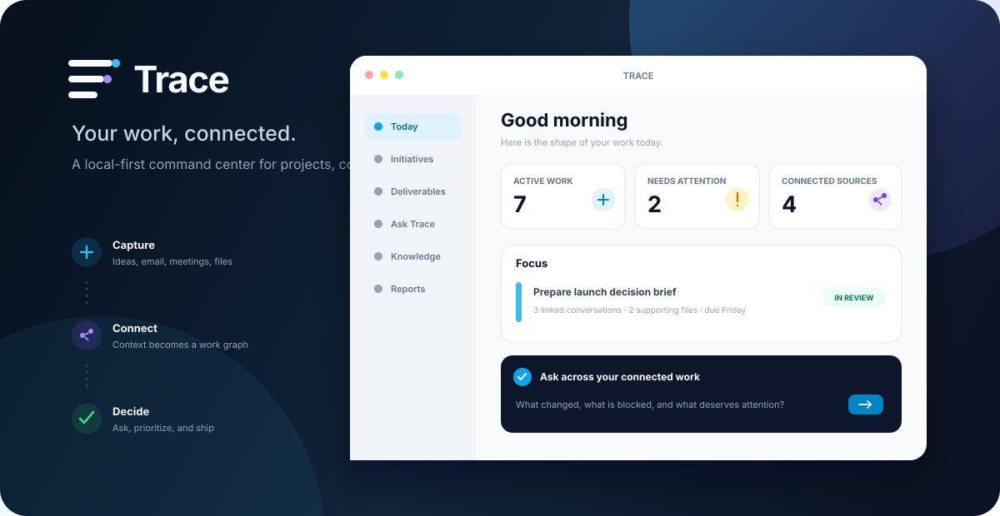

# Trace

  

   

  
  
  
  
  

  **A local-first desktop workspace that turns projects, conversations, files, meetings, and commitments into one connected map of work.**

> [!IMPORTANT]
> Trace is an early-stage, macOS-first project. It is useful today, but its data model and APIs can still change. Back up important data and review AI-generated output before relying on it.

## Table of contents

- [What Trace is](#what-trace-is)
- [Why it exists](#why-it-exists)
- [Feature tour](#feature-tour)
- [How Trace fits together](#how-trace-fits-together)
- [Data model](#data-model)
- [Privacy and network behavior](#privacy-and-network-behavior)
- [Requirements](#requirements)
- [Quick start](#quick-start)
- [Configuration](#configuration)
- [Local data, backup, and recovery](#local-data-backup-and-recovery)
- [Development guide](#development-guide)
- [Security model](#security-model)
- [Troubleshooting](#troubleshooting)
- [Current limitations](#current-limitations)
- [Repository map](#repository-map)
- [Contributing](#contributing)
- [FAQ](#faq)
- [License](#license)

## What Trace is

Trace is a personal work system for people whose real work does not fit neatly into a list of tasks. It keeps the objects you deliver and the context behind them in the same local workspace:

- initiatives and their strategic framing;
- deliverables, states, priorities, due dates, and checklists;
- captures, conversations, notes, and meeting material;
- stakeholders and the work connected to them;
- Gmail threads, Google Calendar events, and Google Drive files;
- explicit and inferred relationships in a navigable knowledge graph; and
- source-grounded AI answers and reports that preserve citations for review.

The application is a native Tauri desktop shell with a React interface and a Rust core. SQLite is the durable source of truth. Kùzu provides the graph projection used by Brain. Credentials are kept outside the database in macOS Keychain.

Trace is intentionally local-first. There is no Trace account, hosted Trace database, analytics service, or mandatory synchronization backend in this repository. Optional integrations communicate directly with their providers only when configured.

## Why it exists

Most project tools capture the final task but lose the reasoning that created it. A line such as “send revised launch brief” rarely explains:

- which initiative it advances;
- which meeting changed the direction;
- who is waiting for it;
- where the latest source file lives;
- what assumption was superseded;
- which email thread contains the decision; or
- why it matters this week.

Trace treats those connections as first-class data. The goal is not to add another inbox. The goal is to make the surrounding context retrievable when a decision, status update, report, or next action needs it.

The product follows four principles:

1. **Local data is the default.** The workspace remains on the Mac unless an optional feature needs a named external service.
2. **Context should be inspectable.** AI answers, inferences, and reports should lead back to their evidence.
3. **Automation should be reviewable.** Suggested links, extracted work, and generated report sections remain visible to the user.
4. **Capture should be faster than organizing.** Lightweight capture surfaces can collect material before it is promoted into structured work.

## Feature tour

### Initiatives, deliverables, and tasks

Initiatives hold the strategic frame: the outcome, theme, or body of work that gives individual outputs meaning. An initiative can be live, paused, shipped, or parked.

Deliverables are the concrete things being produced. Trace supports a range of deliverable types, including decks, design documents, prototypes, analyses, research, code, emails, meeting preparation, specifications, reports, roadmaps, briefs, and plans. Deliverables move through backlog, todo, drafting, in-review, shipped, or killed states.

The deliverables workspace provides:

- a state-based board with drag-and-drop movement;
- priority and ordering controls;
- due dates, notes, labels, and linked initiatives;
- stakeholder ownership and relationship context;
- checklists for smaller tasks;
- attached files and folders;
- related meetings, messages, and graph context; and
- shipped-state history.

### Fast capture and conversation intake

Trace has several entry points for material that is not structured yet:

- **Capture Inbox** stores thoughts, links, and rough notes.
- **Quick Capture** opens globally with Command/Ctrl + Shift + M.
- **Spotlight Ask** opens with Command/Ctrl + Shift + Space.
- **Conversation ingest** turns pasted conversation context into reviewable initiative or deliverable candidates.
- **Menu-bar access** keeps current work and capture close without requiring the main window.

Captures can be promoted into initiatives or deliverables. Extracted candidates are validated before writes, and promotion preserves the relationship to the original source.

### Ask across the workspace

Ask is a conversational retrieval surface over Trace data. It can search the local workspace, assemble context, call approved tools, and show the evidence used for an answer.

The interface includes:

- persistent local chat history;
- citations and a “why this answer” view;
- visible tool activity;
- retrieval over structured records and semantic memory;
- clarification and confirmation steps for sensitive writes;
- cancellation for long-running turns; and
- source scoring for inspected graph nodes.

Gemini powers AI-dependent Ask behavior. Without a Gemini key, the rest of the workspace remains usable.

### Reports with provenance

Reports turn workspace evidence into editable, reviewable output. The report pipeline supports:

- scoped source previews before generation;
- multi-step generation with visible progress;
- citations and provenance for evidence-based sections;
- clarification requests when the source set is ambiguous;
- section-by-section editing and steering;
- a review queue; and
- export flows, including Google document targets when Drive editing scopes are available.

Built-in report directions include quarterly reporting and decision-memo style output. Generated prose is a draft, not an authoritative record.

### Weekly planning

The Week view brings scheduled work and delivery commitments into one planning surface. With Google Calendar connected, Trace caches calendar events locally and can use them alongside deliverables and meetings.

### Work Mail

Work Mail is a focused layer over Gmail rather than a replacement for the entire inbox. It can:

- sync thread and message metadata into the local workspace;
- classify attention, relevance, message type, and priority;
- define work scope through explicit domains and sender rules;
- connect threads to initiatives, deliverables, stakeholders, and files;
- keep Trace review state separate from Gmail unread state;
- surface mail that needs attention or arrived after a review checkpoint;
- compose and send replies through Gmail;
- preserve local drafts and copied attachments across restarts;
- produce digests and optional AI analysis; and
- record overrides so classification remains inspectable.

Remote email HTML is treated as untrusted. Trace sanitizes it, suppresses remote tracking resources, restricts embedded content, and opens ordinary links through the system browser.

### Files and Google Drive

Files can be linked directly to work objects. Trace supports local file and folder relationships, watched folders, Drive browsing, Drive transcript intake, and viewers or editors for selected Google document types.

The file workspace can connect:

- local files and directories;
- Google Drive files;
- Google Docs, Sheets, and Slides;
- meeting transcripts;
- initiatives, deliverables, and stakeholders; and
- the graph and semantic index.

Trace validates paths before handing them to the operating system and limits inline remote previews to explicitly trusted providers.

### Meetings

Meetings combine preparation, source material, stakeholders, and follow-up. The meeting workflow includes:

- meeting records and stakeholder links;
- calendar-backed scheduling;
- uploaded minutes and Drive transcript import;
- optional voice transcription;
- extracted action suggestions;
- approval or dismissal of suggested actions;
- initiative notes; and
- weekly digest generation.

Extracted actions remain pending until reviewed.

### Stakeholder lens

The stakeholder workspace gathers the work surrounding a person into one view: active deliverables, shipped output, meetings, relevant mail, notes, and relationship context. Stakeholder records can include a role, email, notes, avatar, and manually controlled ordering.

### Brain knowledge graph

Brain is an interactive graph explorer over the relationships in the workspace. SQLite remains authoritative; the Kùzu graph is a rebuildable projection optimized for relationship queries.

Brain includes:

- 2D and 3D graph exploration;
- search, focus modes, filters, and saved views;
- path finding between work objects;
- community overlays and alternative layouts;
- a time scrubber;
- a node inspector;
- read-only Cypher queries with bounded results;
- inferred relationship review;
- supersession history; and
- feedback-driven template and threshold learning.

The diagnostics and learning views expose evaluation results, tool activity, prompt-injection signals, inference review, and learned policy state.

### Local MCP integration

Trace bundles a local Model Context Protocol sidecar. It can be installed from Settings and configured in Claude Desktop using the generated snippet.

The MCP surface exposes bounded tools for initiatives, deliverables, captures, stakeholders, work-context retrieval, and Brain queries. Write tools log their activity. Destructive tools require explicit matching confirmation fields rather than accepting an ambiguous delete request.

### Siri and Apple Shortcuts

An optional local HTTP API provides two small remote surfaces:

- **/capture** for adding a capture; and
- **/ask** for asking Trace a question.

The server starts only when a Tailscale interface is detected. It binds to localhost and the detected Tailscale address, requires a high-entropy bearer token, limits request sizes, and does not intentionally expose a public internet listener. The token is generated and stored in Keychain.

## How Trace fits together

~~~mermaid
flowchart LR
  UI[React + TypeScript UI] -->|typed IPC| TC[Tauri commands]
  TC --> CORE[Rust application core]
  CORE --> SQL[(SQLite source of truth)]
  CORE --> KG[(Kùzu graph projection)]
  CORE --> KC[macOS Keychain]
  CORE --> GOOGLE[Google APIs]
  CORE --> GEMINI[Gemini APIs]
  CORE --> MCP[Local MCP sidecar]
  SIRI[Siri / Apple Shortcuts] -->|Tailscale + bearer token| CORE
  FILES[Local files and folders] --> CORE
~~~

| Layer | Technology | Responsibility |
| --- | --- | --- |
| Desktop shell | Tauri 2 | Native windows, tray, global shortcuts, capabilities, IPC, and packaging |
| Interface | React 18, TypeScript, Vite, Tailwind | Workspaces, editors, graph controls, settings, and review flows |
| Query state | TanStack Query and Zustand | Cached IPC queries and local interaction state |
| Application core | Rust and Tokio | Validation, orchestration, integration clients, migrations, and background work |
| Durable store | SQLite through SQLx | Primary workspace records, logs, settings, citations, and cached integration data |
| Graph store | Kùzu | Rebuildable relationship projection and graph traversal |
| AI provider | Gemini | Optional generation, extraction, embedding, classification, and retrieval support |
| Local agent bridge | MCP over stdio | Controlled access for compatible desktop AI clients |
| Remote shortcut bridge | Axum over Tailscale | Authenticated capture and Ask endpoints |

### A typical write

~~~mermaid
sequenceDiagram
  participant U as User
  participant R as React UI
  participant T as Tauri command
  participant C as Rust core
  participant S as SQLite
  participant G as Brain projection

  U->>R: Create or update work
  R->>T: Invoke typed command
  T->>C: Validate input and authorization boundary
  C->>S: Parameterized transaction
  S-->>C: Committed record
  C->>G: Mark graph dirty / rebuild projection
  C-->>R: Typed result and invalidation event
  R-->>U: Updated workspace
~~~

The frontend does not have a raw SQL capability and does not read credentials. Privileged operations are implemented as named Rust commands with typed inputs.

## Data model

The exact schema evolves through append-only migrations, but the conceptual model is:

~~~mermaid
erDiagram
  INITIATIVE ||--o{ DELIVERABLE : frames
  DELIVERABLE ||--o{ TASK : contains
  INITIATIVE }o--o{ STAKEHOLDER : involves
  DELIVERABLE }o--o{ STAKEHOLDER : serves
  MEETING }o--o{ STAKEHOLDER : includes
  MEETING }o--o{ INITIATIVE : informs
  GMAIL_THREAD }o--o{ INITIATIVE : relates_to
  GMAIL_THREAD }o--o{ DELIVERABLE : relates_to
  GMAIL_THREAD }o--o{ STAKEHOLDER : involves
  FILE }o--o{ INITIATIVE : supports
  FILE }o--o{ DELIVERABLE : supports
  CAPTURE }o--o| INITIATIVE : promotes_to
  CAPTURE }o--o| DELIVERABLE : promotes_to
  CONVERSATION ||--o{ DELIVERABLE : yields
  REPORT }o--o{ SOURCE : cites
~~~

SQLite records the durable entities and relationships. Brain translates the relevant subset into graph nodes and edges, adds reviewable inference metadata, and caches layouts separately. A graph rebuild must not be treated as a backup of the SQLite database.

## Privacy and network behavior

Trace does not require an account or a Trace-hosted service. Optional features do send selected data to external providers:

| Feature | Data that can leave the Mac | Destination | When |
| --- | --- | --- | --- |
| Gemini features | The prompt and selected workspace context; embeddings when semantic indexing is requested | Google Gemini APIs | Only after a key is configured and an AI feature runs |
| Gmail | OAuth requests, message synchronization, labels, and replies or attachments you send | Google Gmail APIs | When Gmail is connected and sync/send is invoked |
| Calendar | OAuth requests and cached event reads/writes | Google Calendar APIs | When Calendar is connected and sync or editing is invoked |
| Drive and editors | OAuth requests, file metadata/content, and document edits | Google Drive, Docs, Sheets, and Slides APIs | When Drive is connected and the relevant action is invoked |
| Public URL retrieval | The requested public URL and normal HTTP metadata | The selected public host | When an agent retrieval action is approved or invoked |
| Siri / Shortcuts | Capture or Ask request content | Your Mac over the private Tailscale path | When your Shortcut calls the local API |

Local application data is not end-to-end encrypted by Trace. It inherits the protection of the macOS user account, filesystem permissions, FileVault configuration, and the physical security of the Mac. Credentials receive the stronger macOS Keychain boundary.

If the workspace contains employer, customer, health, financial, legal, or other regulated information, verify that each configured provider is permitted by the relevant policy before enabling it.

## Requirements

Trace currently targets macOS.

### Runtime

- macOS 11 or later;
- a user account able to access macOS Keychain; and
- optional network access for configured Google, Gemini, or public URL features.

### Development

- Xcode Command Line Tools;
- Node.js 20.19 or newer, or 22.12 or newer;
- Corepack and pnpm 10;
- a stable Rust toolchain;
- CMake for native dependencies; and
- Git.

Install the Apple toolchain with:

~~~bash
xcode-select --install
~~~

Install Rust using the official instructions at [rustup.rs](https://rustup.rs/). Node can be managed with any version manager that satisfies the versions above.

## Quick start

There are no official prebuilt releases yet. Run Trace from source:

~~~bash
git clone https://github.com/thashreefkv/trace.git
cd trace
corepack enable
pnpm install --frozen-lockfile
pnpm tauri dev
~~~

The first Tauri development start builds and stages the MCP sidecar before launching Vite, so it takes longer than a frontend-only start.

For the browser-only UI shell:

~~~bash
pnpm dev
~~~

Many features require the Tauri runtime and will not work in a normal browser tab. Use browser-only mode for visual frontend work, not end-to-end application testing.

### First-run checklist

1. Open **Profile** and add the identity information you want Trace to use.
2. Create an initiative or add a quick capture.
3. Open **Settings → Connections** to configure only the integrations you need.
4. Add a Gemini key if you want Ask, extraction, semantic memory, or AI classification.
5. Add a Google Desktop OAuth client ID before connecting Gmail, Calendar, or Drive.
6. Review **Settings → AI** before enabling heavy AI workflows; optional daily and monthly budgets can warn or block.
7. Back up the application-support directory after meaningful use.

## Configuration

### Environment variables

Trace intentionally has a small environment surface:

| Variable | Required | Purpose |
| --- | --- | --- |
| TRACE_GOOGLE_CLIENT_ID | Only for Google integrations | Public OAuth client ID for a Google Desktop app |
| TRACE_SIRI_PORT | No | Overrides the local Siri / Shortcuts API port; the default is 8421 |

Use [.env.example](.env.example) as a reference. Trace does not automatically load that file into packaged builds.

### Gemini

1. Obtain an API key from [Google AI Studio](https://aistudio.google.com/app/apikey).
2. Open **Settings → Connections → Gemini API**.
3. Paste the key, save it, and use the built-in test action.
4. Open **Settings → AI** to inspect usage, set alert thresholds, or enable hard budget caps.

The key is stored in macOS Keychain under the Trace credential service. It is not written to the repository or SQLite database.

Gemini-dependent features include Ask, semantic embeddings, AI-assisted email intelligence, extraction, memory consolidation, report generation, and some meeting workflows. Exact request context varies by feature.

### Google OAuth

Trace uses the OAuth 2.0 installed-app authorization-code flow with PKCE and callback-state validation. A desktop binary cannot safely keep a client secret, so Trace neither requires nor embeds one.

#### Create the client

1. Create or select a project in [Google Cloud Console](https://console.cloud.google.com/).
2. Configure the OAuth consent screen for the users who should be able to connect.
3. Enable only the APIs you plan to use:
   - Gmail API;
   - Google Calendar API;
   - Google Drive API;
   - Google Docs API;
   - Google Sheets API; and
   - Google Slides API.
4. Create an OAuth client with application type **Desktop app**.
5. Copy the client ID. Do not copy a client secret into Trace.

#### Provide the client ID

For development, export it in the shell that launches Tauri:

~~~bash
export TRACE_GOOGLE_CLIENT_ID="your-client-id.apps.googleusercontent.com"
pnpm tauri dev
~~~

The Rust build can also capture the value at compile time. This is convenient for a locally packaged app launched from Finder:

~~~bash
TRACE_GOOGLE_CLIENT_ID="your-client-id.apps.googleusercontent.com" pnpm tauri build
~~~

OAuth client IDs are public identifiers, not passwords. Restrict the Google OAuth client appropriately and never place a client secret, refresh token, or API key in source control.

#### Requested scopes

Connections are separate so users can grant only the capabilities they want.

| Connection | Requested capabilities |
| --- | --- |
| Gmail | Read mail, modify labels/state, and send mail |
| Calendar | Read and manage calendar events plus identify the connected account |
| Drive | Read Drive files, identify the account, and edit Docs, Sheets, and Slides |

Google may require consent-screen testing users or verification depending on the account type, publication status, and scopes. That configuration lives in the Google Cloud project, not in this repository.

#### Connect inside Trace

Open **Settings → Connections** and connect Gmail, Drive, or Calendar separately. Trace opens the system browser and waits on a one-use loopback callback. Refresh and access tokens are then stored in Keychain; non-secret expiry metadata remains in the private application-support directory.

### Apple Notes

The Connections page includes Apple Notes folder setup and synchronization controls. This is an optional local source. Review the selected folders before syncing, especially if Notes contains unrelated personal or sensitive material.

### MCP and Claude Desktop

Build the sidecar if needed:

~~~bash
pnpm build:mcp
pnpm prepare:mcp-sidecar
~~~

Then open **Settings → Connections → MCP server**:

1. choose **Reinstall** to copy the sidecar into Trace's private support directory;
2. expand the raw install details;
3. copy the generated Claude Desktop configuration snippet;
4. merge it into the displayed Claude configuration path; and
5. restart Claude Desktop.

Trace displays the exact binary, database, and log paths because they vary by machine and build. MCP tool calls are written to a size-limited rotating local log. Do not expose the local MCP process to an untrusted transport.

### Siri and Apple Shortcuts

1. Install Tailscale on the Mac and sign in.
2. Quit and relaunch Trace so it can detect the interface.
3. Open **Settings → Connections → Siri & Apple Shortcuts**.
4. Copy the displayed Tailscale URL.
5. Reveal and copy the bearer token.
6. In Shortcuts, use **Get Contents of URL**, choose the **/capture** or **/ask** route, and add an Authorization header in the form shown by Trace.

Treat the token like a password. If it appears in a screenshot, shared Shortcut, log, or message, regenerate it from Settings and update every Shortcut that used the old value.

For a complete action-by-action walkthrough, see [the Siri and Apple Shortcuts guide](docs/siri/README.md).

## Local data, backup, and recovery

Trace uses the legacy bundle identifier **com.thash.project-manager** so existing installations retain their data after the product and repository rename.

The default macOS directory is:

~~~text
~/Library/Application Support/com.thash.project-manager/
~~~

Important contents include:

| Path | Purpose |
| --- | --- |
| data.db | SQLite source of truth |
| brain.kuzu | Rebuildable Brain graph projection |
| brain.kuzu.meta.json | Graph projection metadata |
| draft_attachments/ | Private copies of attachments used by local email drafts |
| mcp.log and rotations | Local MCP tool audit log |
| installed sidecar/config artifacts | Local MCP integration files |

Credentials such as Gemini keys, Google OAuth tokens, and the Siri bearer token are stored in macOS Keychain and are not included when copying this directory.

### Back up

1. Quit Trace and any MCP client using its database.
2. Copy the entire application-support directory to an encrypted backup.
3. Preserve Keychain separately through the normal macOS backup strategy, or plan to reconnect integrations after restore.

Copying only **brain.kuzu** is not a valid backup. The SQLite database is authoritative.

### Restore

1. Quit Trace and connected MCP clients.
2. Keep a safety copy of the current directory.
3. Restore the backed-up directory to the same bundle-identifier path.
4. Launch the same or a newer compatible Trace build.
5. Reconnect providers if Keychain entries were not restored.
6. Rebuild Brain from its UI if the graph projection reports an incompatible storage version.

Database migrations run automatically on startup and are designed to preserve existing records. Downgrading after a migration is not guaranteed to work.

## Development guide

### Install dependencies

~~~bash
corepack enable
pnpm install --frozen-lockfile
~~~

The frontend and Rust dependency locks are committed. Keep both lockfiles synchronized with their manifests.

### Common commands

| Command | Purpose |
| --- | --- |
| pnpm dev | Run the Vite frontend only |
| pnpm typecheck | Run TypeScript without emitting files |
| pnpm build | Type-check and create production web assets |
| pnpm tauri dev | Build the sidecar and run the full desktop app |
| pnpm build:mcp | Build the release MCP server |
| pnpm prepare:mcp-sidecar | Stage the target-specific sidecar for Tauri |
| pnpm tauri build | Build the desktop bundle and sidecar |
| pnpm eval | Run the Rust evaluation harness |
| pnpm eval:ci | Run evaluation output in JSON mode |

### Verification

Run the same essential checks used for the public release:

~~~bash
pnpm typecheck
pnpm build
pnpm audit --prod
cargo check --locked --manifest-path src-tauri/Cargo.toml --workspace
cargo test --locked --manifest-path src-tauri/Cargo.toml --workspace --no-fail-fast
~~~

CI repeats frontend checks, builds and stages the MCP sidecar on macOS, runs the complete Rust workspace suite, and scans the full Git history with Gitleaks.

### Database changes

Migrations live in **src-tauri/migrations/** and are applied in order by the shared Rust core.

When changing the schema:

1. add a new numbered migration instead of editing a migration already used by released builds;
2. keep the migration safe for databases that already contain user data;
3. update the Rust migration registry;
4. add a preservation or upgrade test;
5. update affected models and queries together; and
6. consider whether Brain needs a rebuild or projection-version change.

Use parameterized SQL for values. Do not restore frontend raw-SQL access.

### Frontend changes

- Keep privileged work behind typed IPC functions in **src/lib/ipc.ts**.
- Treat rendered email, web, AI, and file metadata as untrusted.
- Use the shared safe-link helpers before opening dynamic URLs.
- Preserve keyboard and window behavior in the Tauri runtime.
- Follow [.claude/design-system.md](.claude/design-system.md) for visual conventions.
- Test narrow windows as well as the standard 1040 × 720 desktop size.

### Rust changes

- Keep reusable data and integration logic in **src-tauri/shared/**.
- Keep native application commands and window behavior in **src-tauri/src/**.
- Apply input and output limits at external boundaries.
- Return generic user-facing network errors; keep sensitive details in local diagnostics where appropriate.
- Use the shared credential abstraction rather than writing new token files.
- Keep MCP destructive actions confirmation-gated.
- Pin Git dependencies to reviewed immutable revisions.

### Building a local application bundle

~~~bash
pnpm tauri build
~~~

The default repository configuration creates a local ad-hoc signed macOS build. It is not a notarized public release. Distribution requires an Apple Developer identity, hardened-runtime review, signing, notarization, update-channel design, and release-specific testing.

## Security model

Trace has undergone a public-release hardening pass, but no software should be described as perfectly secure. The primary controls are:

- **Credential isolation:** API keys, OAuth tokens, and the Siri token use macOS Keychain in production.
- **Desktop OAuth:** Google authorization uses PKCE, a random state value, a loopback-only callback, bounded request parsing, and no client secret.
- **Least-privilege desktop capabilities:** Tauri exposes named commands, restricted opener permissions, and no frontend SQL plugin.
- **Content security policy:** production and development CSPs restrict scripts, objects, forms, frames, and outbound connections.
- **Untrusted HTML handling:** email HTML is sanitized with DOMPurify, remote resources are removed, and embedded content is sandboxed.
- **Safe navigation:** dynamic links and local paths are validated before the operating system opens them.
- **SSRF resistance:** public URL retrieval rejects credentials, local names, loopback, private, link-local, metadata, multicast, documentation, and reserved addresses; DNS results and redirects are revalidated, HTTPS cannot downgrade, responses are type- and size-limited, and targets are pinned for the request.
- **Bounded local API:** Siri requests use bearer authentication, constant-time token comparison, generic errors, body and field limits, safe response headers, and private-network binding.
- **Prompt boundaries:** imported email and web content is labeled as untrusted, suspicious instructions are logged, and diagnostics expose prompt-injection signals.
- **Review gates:** extracted actions, inferred relationships, and destructive MCP tools require review or matching confirmation.
- **Supply-chain hygiene:** locks are committed, Git dependencies are revision-pinned, Dependabot is configured, GitHub Actions are commit-pinned, and CI scans complete history for secrets.

For the review record and remaining caveats, see [security_best_practices_report.md](security_best_practices_report.md). Report vulnerabilities privately through [SECURITY.md](SECURITY.md).

### Threat boundaries

Trace assumes:

- the local macOS account and process environment are trusted;
- the user controls which provider accounts and folders are connected;
- Google and Gemini are external processors for data sent to them;
- AI output can be incorrect or adversarial and is not an authorization decision;
- content arriving from mail, files, web pages, calendars, MCP clients, or models is untrusted; and
- a locally modified binary can bypass application controls.

Trace does not protect data from malware already running as the same macOS user, an unlocked stolen session, a compromised provider account, or a user intentionally exporting information.

### Reporting a vulnerability

Do not open a public issue containing an exploit, private workspace data, or credential material. Use the repository's [private security advisory form](https://github.com/thashreefkv/trace/security/advisories/new) and follow [SECURITY.md](SECURITY.md).

## Troubleshooting

### Google says the integration is not configured

The process cannot see **TRACE_GOOGLE_CLIENT_ID**. Export it in the same shell before **pnpm tauri dev**, or include it while building the local bundle. A Finder-launched development build does not inherit arbitrary variables from a terminal session.

### OAuth opens but never returns to Trace

- Confirm the credential is a Google **Desktop app** client.
- Keep Trace running while the browser flow completes.
- Check whether a firewall or security product blocks loopback callbacks.
- Retry once; every attempt creates a new callback port, state value, and PKCE verifier.
- If the consent screen is in testing mode, ensure the account is an allowed test user.

### A Keychain prompt appears

macOS may ask whether the current Trace build can access an existing credential after the binary identity or signing state changes. Verify that you launched the expected local build before allowing access.

### The MCP server is missing

Run:

~~~bash
pnpm build:mcp
pnpm prepare:mcp-sidecar
~~~

Then use **Reinstall** in the MCP settings panel and restart the desktop client. Inspect the local MCP log from the same panel if tools fail.

### The Rust build fails while compiling native dependencies

Confirm Xcode Command Line Tools and CMake are installed, then check the active Rust host with **rustc -vV**. The staged MCP filename must match that host target.

### Brain reports a graph or storage mismatch

Quit other Trace or MCP processes that may hold the graph, reopen Trace, and request a Brain rebuild. Preserve **data.db** before manually changing graph files.

### A remote preview is unavailable

This can be intentional. Trace only embeds a small provider allowlist and uses a strict frame policy. Open the validated link in the system browser instead.

### The production frontend warns about large chunks

Vite can report large JavaScript chunks because the graph and editor workspaces are substantial. The warning does not fail the build, but route-level splitting remains a worthwhile optimization.

### I want to start over

Back up the full application-support directory first. Removing it deletes local workspace records and draft attachments, while Keychain credentials may remain separately. There is intentionally no destructive reset command in this README.

## Current limitations

- macOS is the only supported desktop target.
- The project is pre-1.0 and does not promise schema or API stability.
- There is no official signed/notarized binary release or auto-updater.
- There is no Trace-hosted sync, collaboration server, web account, or mobile client.
- Google integrations require your own OAuth Desktop client configuration.
- AI features require a separately billed Gemini API key and can produce incorrect results.
- AI usage costs shown by Trace are estimates and should be reconciled with provider billing.
- Local data is not independently encrypted by Trace; enable FileVault for at-rest device protection.
- Gmail scope approval can be constrained by Google Workspace administrators.
- Some native and graph dependencies make first builds relatively slow.
- Browser-only development cannot exercise native windows, Keychain, filesystem access, MCP installation, or global shortcuts.
- The legacy bundle identifier remains visible in local filesystem paths for data continuity.
- No software license has been selected.

## Repository map

~~~text
.
├── .github/                    CI, Dependabot, and ownership rules
├── docs/                       Public artwork and documentation assets
├── scripts/                    Build-time sidecar staging
├── src/
│   ├── components/             Shared React interface components
│   ├── lib/                    IPC, query, formatting, and safety helpers
│   └── routes/                 Product workspaces and settings pages
├── src-tauri/
│   ├── bin/
│   │   ├── eval-runner/        Evaluation command-line program
│   │   └── mcp-server/         Local MCP sidecar
│   ├── capabilities/           Tauri permission declarations
│   ├── migrations/             Ordered SQLite migrations
│   ├── shared/                 Reusable Rust domain and integration core
│   └── src/                    Native app commands, windows, and HTTP API
├── CONTRIBUTING.md             Contribution workflow
├── SECURITY.md                 Private vulnerability-reporting policy
├── package.json                Frontend and desktop scripts
└── pnpm-lock.yaml              Locked JavaScript dependency graph
~~~

## Contributing

Issues and focused pull requests are welcome. Start with [CONTRIBUTING.md](CONTRIBUTING.md).

Before opening a pull request:

1. remove real workspace data, email addresses, provider responses, screenshots, and credentials from fixtures;
2. run the frontend and Rust verification commands;
3. add tests for behavior or migration changes;
4. describe user-visible behavior, security implications, and known limitations;
5. keep the pull request focused on one concern; and
6. use the private advisory flow for vulnerabilities.

Large product or schema changes are easier to evaluate after a proposal issue explains the use case and migration impact.

## FAQ

### Is Trace a cloud service?

No. This repository builds a local desktop application. Optional Gemini and Google features call those providers directly, and Siri access uses your private Tailscale network.

### Can I use Trace without Gemini?

Yes. Core initiatives, deliverables, tasks, captures, stakeholders, meetings, files, and manual relationships remain useful. Ask generation, embeddings, automated extraction, and other AI-assisted features will be unavailable or reduced.

### Can I use Trace without a Google account?

Yes. Gmail, Calendar, Drive, and Google editors are optional. Local workspaces and local file relationships do not require them.

### Why does the data directory still say project-manager?

The app keeps its original bundle identifier so a rename does not strand existing user data in a second directory.

### Is the Kùzu graph the primary database?

No. SQLite is the durable source of truth. Kùzu is a graph projection and can be rebuilt.

### Does Trace upload my whole database to Gemini?

No blanket database upload exists. AI features construct task-specific prompts or embedding requests from selected context. You should still inspect the feature and provider policy before using sensitive data.

### Are credentials stored in the repository or database?

No. Production credentials use macOS Keychain. Non-secret configuration and expiry metadata may exist in the private application-support directory.

### Can multiple people collaborate in one Trace workspace?

Not currently. The architecture is a local, single-user desktop workspace.

### Does Trace support Windows or Linux?

Not as a supported product today. Parts of the shared core are portable, but native window behavior, Keychain integration, packaging, and the tested release path are macOS-specific.

### Can I distribute a build I compile?

The repository currently has no open-source license grant. You may inspect and run it where copyright law permits, but redistribution and modified publication are not granted unless a license is added.

## License

No software license has been selected yet. Default copyright restrictions therefore apply. The source is publicly visible for inspection and collaboration, but public visibility alone does not grant permission to copy, redistribute, sublicense, or publish modified versions.

If a license is added later, this section and a root license file will be updated together.
